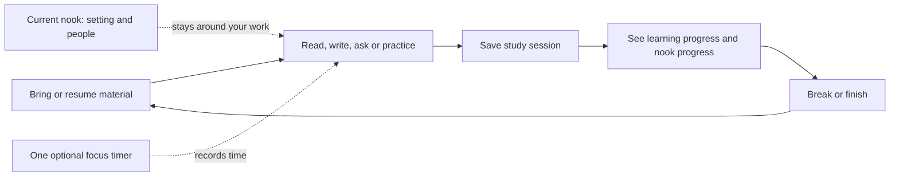

# Nooks — unified UX master plan

**Decision draft · October 2, 2026**

Nooks is a study workspace inside ChatGPT where your work stays organized, your nook becomes personal, and other people can quietly study alongside you.

The product should be explainable in one sentence: **Bring your material, study in your nook, and come back to the same work with visible progress.**

This plan combines research into study creation/context, focus timers, collections and rewards, and live study communities. Competitor mechanics below are documented patterns, not evidence that copying them guarantees retention. Proposed defaults and percentages are design hypotheses to test with students.

## 1. The appeal and where to put our effort

The strongest initial appeal is **turning a solitary ChatGPT study session into a place that feels yours, with other people around**. The personal environment, quiet company and lasting objects give Nooks a recognizable identity. Generating flashcards alone is already offered by competitors, including Quizlet inside ChatGPT.

That emotional hook needs dependable study work underneath it. Otherwise the beautiful space becomes another tab a student stops opening. An independent UX review therefore recommends this first-release allocation of design and implementation effort:

| Share | Emphasis | How it should feel |
| --- | --- | --- |
| **50%** | Learning and continuity | Create quickly, edit naturally, practice well, find the same work tomorrow. |
| **25%** | Personal nook and atmosphere | Recognizable places, excellent artwork, restrained motion, music, lasting customization. |
| **15%** | Quiet community | Other students are present; friends are easy to find; joining never becomes a social obligation. |
| **10%** | Progress and unlocks | Studying visibly changes the nook, with one understandable next reward. |

These are **effort allocations**, not measured student preferences or percentages of screen area. A background can fill the screen without demanding attention. During a quiz, the question dominates; at a session boundary, progress becomes briefly prominent. Marketing should lead with the distinctive place/community feeling and immediately demonstrate useful study work.

Initial concept to validate: **“Your study nook in ChatGPT.”** Show a real note becoming a quiz inside a recognizable nook, with quiet company and one earned object. Avoid leading with a grid of twelve tools or a list of currencies.

## 2. What the references teach us

| Reference | Documented structure | Pattern to adopt | What to leave behind |
| --- | --- | --- | --- |
| NotebookLM, RemNote | Selected sources feed notes, grounded chat and practice; source links remain useful. | Material enters once and can power many activities. Make “Using…” visible. | Another mandatory folder layer or hidden whole-library context. |
| Quizlet, Knowt | Notes/sets lead into multiple practice modes; creation reuses existing material. | One saved collection, multiple ways to study it. | Separate generators and duplicate libraries for every mode. |
| Forest | A timed session leaves a visible tree/collection; currencies unlock options. | Effort creates permanent visible change. | Punishing unrelated app use or destroying friends' progress. |
| Finch, Study Bunny | Goals or study time support companions, customization and return loops. | Small, approachable actions and an obvious repeat/break path. | Pet upkeep obligations, several currencies and purchase gates after earning. |
| Spirit City | A persistent setting, productivity tools and environment-related discoveries. | Distinct discoveries that belong to each nook. | Making students solve environmental puzzles to earn basic study progress. |
| Flow, Session, Focus To-Do | Timers stay small, connect to intent/tasks and support recurring work/break cycles. | Start focus from the current work; resume that work after a break. | A separate timer setup workflow before studying. |
| FocusTown | Place discovery → shared live server → focus → character customization. | The place and the people make studying feel less isolated. | Requiring a 3D simulation to deliver presence. |
| StudyStream, Focusmate, LifeAt | Quiet shared work, goals/check-ins, presence, optional group timing or communication. | Quiet participation by default; social actions at natural pauses. | A permanent chat feed, compulsory video or appointment booking. |

Study Together now directs new users to StudyStream; do not count it as an independent current competitor. The relevant FocusTown is **focustown.app**, not the unrelated similarly named focus.town. Public feature descriptions were researched; this is not a claim that every authenticated competitor flow was manually tested.

Evidence and exact links: [study/context research](study-context-research.md), [gamification research](gamification-research.md), [timer research](pomodoro-research.md), [community research](community-study-research.md).

## 3. One loop connects the entire product

The session links the material, activity, optional intention, elapsed focus, current nook, practice outcomes and next step. The student never has to create or name a “session object.” It is the internal connection that prevents timers, quizzes and rewards from becoming unrelated apps.

Studying without a timer remains valid and saves notes, practice outcomes and the resume position. Untimed work does not earn time-based nook unlocks; make that explicit and offer an optional Track focus action. A later count-up option can use the same controller without a countdown. Never silently turn browsing time into reward credit.

Quiz completion, focus completion and leaving the workspace are different events. A quiz saves its answers and results immediately; a timer saves elapsed focus; leaving preserves the current activity. Combine receipts only when events actually coincide. Ending a timer must not submit an unfinished quiz, interrupt typing or invent task completion.

## 4. Three places to go

| Destination | Purpose | Contents |
| --- | --- | --- |
| **Study** | Do the work | Current conversation/material/activity, a compact focus control, and the nook around it. Returns to the current work. |
| **Library** | Find and organize work | Recent, Continue studying, search, optional Course → Topic, and type filters. Notes, sources, cards, quizzes and saved study bookmarks stay together. |
| **Explore** | Choose where and with whom to study | Public nooks, favorites, joined/private nooks and creator discovery. Preview artwork, description, audience/vibe, live occupancy and next discovery. |

**+ Create** is an action, not another destination. Profile, collection, music and people are drawers or small popovers. The current nook name also opens Explore.

Remove separate primary destinations for Flashcards, Quiz, Games, Timer, Garden, XP and task planning. They become actions over the current work or contextual controls. A small Today list can hold study intentions; a full project-management system is unnecessary for the first release.

## 5. The Study screen and its states

The center is reserved for the student's current activity. The same shell changes naturally as their task changes.

- **Starting:** one prompt (“What are you studying?”), Add material, Choose from library, and a quiet Write a note action. Returning students see a specific Continue item first. Use a default nook; do not force a tour, avatar setup or customization before trying the workspace.
- **Conversation:** a readable conversation column. No blank assistant panel, ornamental welcome card or oversized suggestion boxes competing with the text. Inside ChatGPT, use the host conversation and supported UI surfaces; do not promise to replace ChatGPT's entire shell.
- **Note:** a premium document surface, click-to-edit title/body, autosave and a compact formatting toolbar. Flashcards and Quiz are direct actions. Selecting text reveals Explain, Make cards and Quiz for that passage.
- **Cards:** one legible card, progress, reveal and rating. Keyboard and touch both work. At completion, Review missed is more useful than a generic dashboard return.
- **Quiz/exam:** one question or an intentional exam layout, clear answer feedback, and review of missed concepts. Timer completion never steals focus from an answer.
- **Game:** a practice mode over existing cards/questions, not a new content type. Results use the same learning history. Put games under Practice options after the basic modes are clear.
- **Focus running:** time and Pause remain visible; scenery, rewards and people recede. No repeated celebration, join notifications or ambient shimmer on reading controls.
- **Session end:** a small receipt (“25 min saved · 12 cards reviewed”), one reward reveal if earned, and Break / Continue. Dismissal does not lose progress.

On desktop, keep one compact utility strip for focus/music/presence and at most one utility drawer open. On mobile, show one main surface and use a bottom sheet for utilities. Never stack the library drawer, people panel, music panel and reward sheet over the work simultaneously. Audio continues when its controls close. Reduced-motion and muted states apply consistently.

## 6. One creation flow, from any intentional input

**Input → choose output → result opens and saves.** No mandatory title, subject, folder or configuration wizard.

Supported entry points should converge on the same source selection:

| Start | Default source | Fast action |
| --- | --- | --- |
| Type/paste in Create | That text or requested topic | Notes / Cards / Quiz |
| Write in a note | The current draft, including the latest typed sentence | Make cards / Quiz |
| Highlight a paragraph | Only that passage | Explain / Make cards / Quiz |
| Select Library items | Only checked items | Create from selection |
| Open an imported document | That source, optionally selected pages | Notes / Cards / Quiz |
| Open a card set | That set | Review / Quiz / Match |
| Choose a useful chat response | The intentionally supplied excerpt | Save note / Make cards |

A small **Using: This note** or **Using: 3 materials** control always explains scope. It opens a searchable picker; selected items appear as removable chips. Switching output type preserves the prompt and selected material.

Generated content is editable in the same editor as handwritten material. Creation adds a new artifact; AI changes to an existing note are proposed and reviewable. Source changes flag derived items without overwriting human edits. Names are suggested automatically and can be changed inline.

“Any material” is a destination, not an unsupported import promise. Ship pasted text and saved material reliably first, then tested PDF/document/image/link extraction with clear progress and recoverable failures. Lecture recording stays deferred as requested.

Inside ChatGPT, generation uses the supported host/plugin flow. The current public website needs an explicit handoff or separately configured AI service; it must not return unrelated sample content behind an apparently live Generate button.

## 7. Organize the work independently from the nook

**Private Library → optional Course → optional Topic → study items.** Recent and Unfiled work remain easy to find. Never require filing before creation.

A visual nook is a place/community and its collection. It does not own the student's Biology notes. Switching from the Garden to the Library should preserve the open document, sources, cursor, unfinished quiz and practice history. Joining a public nook must never publish private work.

For future sessions, save material IDs, versions, practice position and a concise next step. A user-reviewed study bookmark can restore selected context to a new ChatGPT session. Do not import full ChatGPT history or silently accumulate every item ever opened. The AI retrieves chosen material when needed.

Before account connection, label persistence **Saved on this device**. After authentication, use **Saved to your account** only after server confirmation. Cross-device continuity requires that account. Connecting should offer a one-time import of local drafts with stable IDs, duplicate detection and conflict review, rather than silently discarding or overwriting either copy.

A student should be able to predict three things: **what is being used, where the result is saved, and what will still be here tomorrow.**

## 8. Timer, rewards and learning progress

### One timer

Start directly from a note, deck, quiz or task. Attach that work automatically; an optional intention can refine it. Initial proposal: 25 minutes, with 15/50/custom available behind the duration control. A five-minute break follows focus; a longer break can follow a cycle. Preferences remember the student's choice. Auto-start focus stays off initially.

Pause excludes paused time. Finish saves the earned interval under documented rules; cancel and restart are secondary actions. Reload, background tabs and a second device must reconcile with one authoritative session. Studying from a book is valid; keyboard activity and tab visibility do not prove attention.

When changing nooks during an active session, keep the interval credited to its starting nook and show **This session is earning in Garden** beside the timer; the new nook applies to the next session. Label these totals as time credited here, not physical time spent in the currently visible setting. A later explicit interval-splitting design can replace this. Never award the same minute twice.

### One progress rule, different experiences

Use **saved focus time credited to this nook** as non-spendable progress. No garden coins, magic mana, dungeon gems and pet food balances. Practice accuracy and review history remain separate learning signals; time spent does not imply mastery.

| Nook example | Visible progression | Later discoveries |
| --- | --- | --- |
| Garden | A plant grows, then more planters join the collection | Seasonal plants, a greenhouse setting |
| Rainy Library | A personal shelf gradually fills | A reading lamp, annotated book, hidden reading corner |
| Magic school | Desk objects and an authored magical scene evolve | Wand, cloak, enchanted lamp, an annex |
| Dungeon | A small collection of artifacts gains detail | Rune stones, a friendly creature, a vault |
| Seaside café | The desk and soundtrack become personal | Mug, sketchbook, an additional ambient track |

These are design examples, not final naming or asset specifications. Each path uses consistent milestones and interaction. Start with **five excellent paths**; the thirty visual nooks can share reliable progression templates until individually authored content is ready.

The next milestone is understandable (“15 more min”), while its exact visual detail can remain a surprise. Unlock automatically after a confirmed save. Show the object briefly, where it went and one Place action. Earned objects persist through missed days, breaks and system failures. No second purchase or claim task after earning.

A personal weekly goal is more useful than many simultaneous streak counters. If we keep a streak, use one clear study-day definition with forgiving recovery. Do not reward model token spending, number of generated pages or button clicks.

## 9. Community without turning the workspace into a feed

Browsing a public nook does not publish a profile or study history. **Join** explains the public name/avatar, focus status and optional collection visibility before establishing social presence. Account and public-identity setup happen at that boundary.

The shared nook supplies the scene and community; each student’s earned desk objects are a personal arrangement. Placing an object changes only their view. Other members can inspect an intentionally public collection through the profile, without changing the shared scene.

A small presence control shows a few avatars and an honest studying count. Opening it reveals **Now**, **This week**, and member profiles. Profiles show public nook time and collections; private materials and goals stay private by default. Lifetime hours are secondary, and rankings are optional.

Everyone can use a personal timer in the same nook. A hosted study round offers an explicit Join this round action; joining late earns only time actually spent. Friends and creator communities reuse the same nook interface. Quiet participation is complete participation.

Discovery should answer: **What does this place feel like? Who is it for? Is anyone here? What can I work toward?** One Join button is sufficient. Empty nooks remain usable, with an invitation option; never simulate arrivals as real users.

Private invitations require explicit membership. Public creator publishing needs preview, visibility choice, content review and report/block controls. Creators can shape atmosphere and authored reward paths but cannot access members' private academic work. Defer public text feeds, DMs and voice/video until there is a clear need and a functioning moderation system.

## 10. Three complete journeys

**First visit:** open Nooks → a good default nook is ready → paste lecture text or choose material → Cards → study immediately → optionally start focus. Ask for a name/avatar only when joining the community or saving identity across devices. No multi-step onboarding before the first useful result.

**A normal evening:** Continue Biology → the correct note opens → select a confusing paragraph → Quiz → work through it while the timer runs → finish focus → see saved time and a new planter → take a break → resume the same topic.

**An influencer invitation:** open a nook link → see the creator, setting and actual people → Join → keep existing private material → study → earn that nook's item → return later through Favorites. Joining is about atmosphere and company; it must not require copying files into the creator's nook.

## 11. The anti-bloat rules

1. Three main destinations; one global Create action.
2. One current activity in the center; one optional utility drawer.
3. One canonical Library and one source picker across AI actions.
4. One focus controller across every screen; breaks are phases, not another app.
5. One reward progress rule; content variety comes from art and authored paths.
6. Collections and rankings appear on demand and at session boundaries.
7. No manual saving for ordinary note edits; no repeated metadata entry.
8. No forced avatar, folder, goal, timer or social participation before study.
9. Empty states offer a useful action, not a marketing essay.
10. A new feature must shorten a study task, help someone return to it, or strengthen the nook experience without distracting from it. Otherwise defer it.

## 12. Build order and acceptance gates

| Stage | Build | Gate before expansion |
| --- | --- | --- |
| **A. Reliable study core** | Shared Create/source picker, direct transformations, premium note editor, coherent cards/quizzes, Library and resume | A student can paste material, make cards, edit a note and return tomorrow without assistance or wrong-source output. |
| **B. One session** | Shared timer, current-work binding, break/resume, persisted study outcomes, one visible reward path | Refresh/retry cannot lose writing, reset progress, double-credit time or award an unconfirmed unlock. |
| **C. Quiet community** | Authenticated presence, public/private membership, accurate counts, profiles, optional weekly comparison, moderation | Private content never appears in public data; leaving/rejoining and disconnects have understandable states. |
| **D. Personal expression** | Five polished paths, scene-fit assets, music, placement and a few carefully tuned motion patterns | Objects belong in the scene, controls stay legible, and studying is still the easiest action. |
| **E. Creator ecosystem** | Create/preview/publish nook, invite links, discovery, versioned reward paths, shared sessions | A creator can publish without exposing personal study data or breaking members' earned progress. |

Existing code already implements parts of several stages. This ordering identifies integration priorities, not an assertion that we are starting from nothing. The public preview, a connected ChatGPT plugin, and a production multi-user service have different verification requirements.

### Acceptance tasks for student testing

Observe at least five students without explaining the interface. These are proposed release checks, not measured results:

- Paste a paragraph and make cards without naming or filing anything.
- Turn a selection into a quiz and correctly identify what material it used.
- Find yesterday's note and continue from the right place.
- Change nooks without losing the current work.
- Start focus from the current note in one action; pause and resume without confusion.
- Explain the next unlock and where it was saved after earning it.
- Join a friend's nook and tell what other people can see.

Measure task completion, time to first useful activity, unnecessary steps, source-selection mistakes, recovery after errors and voluntary return. Compare an atmosphere-led entry with a material-led entry. Ask what people remember and what would make them return; do not assume hours, XP, a pretty screenshot or vendor popularity proves useful learning.

The designer's handoff should contain the five Study states, one shared Create component, one source picker, the Library, Explore, one utility drawer system and the session-end receipt. Establish this interaction structure before adding more decorative controls.
