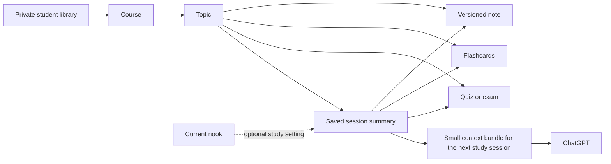

# Nooks study library and continuity

Implemented module contract: `server/organization.mjs` and `server/organization-tools.mjs`. Engine, host bridge, UI, and deployment integration are separate workstreams. This document describes both the implemented data contract and the remaining integration requirements; passing the module tests does not establish production readiness.

## The organizing idea

**Courses organize the work. Nooks set the atmosphere.** A student can review Biology in a café today and a library tomorrow without moving their notes or losing context. Nook rewards and community membership never control access to their academic material.

The library has three levels:

1. **Course** — Biology 101, Organic Chemistry, Interview preparation. A course can have a color, an exam date, and an optional description.
2. **Topic** — Cell respiration, Reaction mechanisms, Dynamic programming. Topics belong to one course.
3. **Study item** — An editable note, flashcard set, quiz, or exam. Each has one canonical saved copy and a stable ID. Items can remain **Unfiled** until the student chooses where they belong.

Saved study sessions sit alongside these items. A session is a short, reviewed bookmark: what the student worked on, what remains unclear, what to do next, and the relevant item IDs. It is not another document folder and is not a chat transcript.



## What students see

The Library opens to recent work, with a simple course list. Selecting a course filters the library; selecting a topic narrows it further. Type filters can show notes, cards, or quizzes without changing where those items live. A visible **Unfiled** destination prevents organization from blocking creation.

Every editor shows a small course/topic breadcrumb. The student can move an item with that control; selecting another nook does not change it. New material may inherit the course/topic actively selected by the student. Do not silently classify personal material from a background inference.

At the end of a study session, **Save for next time** opens a compact form containing a title, summary, and next steps. The student can edit or remove any suggested text before saving. Their next session offers **Continue Biology / Cells**, which reads that summary and selected saved material, then hands a small context bundle to ChatGPT.

The original conversation remains in ChatGPT. Nooks does not claim to reorganize ChatGPT’s sidebar or import an account’s old chats. OpenAI’s current rules forbid requesting broad conversation history, prior-turn arrays, or reconstructing the complete chat log. This design uses intentionally supplied study resources and brief, task-specific summaries. [OpenAI plugin guidelines](https://developers.openai.com/plugins/plugin-guidelines)

## Saved structure

The current workspace envelope remains compatible with existing storage adapters:

```text
workspace
  artifacts[]
    id, kind, title, subject, content/cards/questions
    courseId?, topicId?, revision, createdAt, updatedAt
  organization
    schemaVersion: 1
    courses[]
    topics[]
    sessions[]
    noteRevisions[]
    noteProposals[]
```

| Record | Important fields | Invariant |
| --- | --- | --- |
| Course | `id`, `title`, `description`, `color`, `archived`, `examDate?`, `revision` | Private to one student; archiving does not delete work. |
| Topic | `id`, `courseId`, `title`, `description`, `revision` | Its course must be in the same private library. |
| Study item | `id`, `courseId?`, `topicId?`, `revision`, type-specific content | A topic implies its owning course. An item cannot reference another course’s topic. |
| Saved session | `id`, `courseId?`, `topicId?`, `title`, `summary`, `artifactIds`, `goals`, `nextSteps`, `openQuestions`, `nookId?`, `revision`, `userConfirmedAt` | Only explicit, reviewed continuity content; every item link resolves within the account and selected course/topic. |
| Note revision | `id`, `artifactId`, `revision`, `title`, `content`, optional course/topic, save/supersession timestamps, change source | Immutable snapshot of a superseded note; used for history and recovery. |
| Note proposal | `id`, `artifactId`, `baseRevision`, proposed title/content, reason, creation time | Does not change the note until accepted; cannot apply against a newer base version. |

Legacy items get revision 1 and remain Unfiled. There is no automatic migration of the old free-text `subject` field into potentially incorrect course identities.

All organization operations receive an already authenticated user’s workspace. No operation accepts an owner ID from the client. The storage adapter must preserve the organization object and its links atomically. Private data must not enter community presence events, public nook snapshots, leaderboards, webhook payloads, or telemetry.

## Editing and AI collaboration

The canonical note is Markdown with a revision number. Human and AI-generated content use the same renderer and storage format; the AI does not own a separate copy of the student’s note.

Direct editing:

1. Load the note and its revision, for example revision 7.
2. Keep the draft locally while editing. Show unsaved/saving/saved/error state.
3. Save with `expectedRevision: 7`.
4. The server rejects the write if another client already saved revision 8. The UI keeps the student’s draft and offers review/reload; it never silently replaces the newer note.
5. A successful save archives revision 7 and returns revision 8. The editor must adopt that returned revision before another save.

AI-assisted editing:

1. ChatGPT reads the specific note and current revision.
2. `note_revision_propose` saves proposed replacement text and a short explanation. The live note remains unchanged.
3. The interface shows the current and proposed text for review.
4. Apply sends `proposalId`, `expectedRevision`, and `confirmed: true`. Discard removes only the proposal.
5. An intervening human edit makes the proposal stale. Regenerate or reconcile it against the new note instead of force-applying.

Restoring an old revision also creates a new revision. The history is never rewound. The module retains up to 10 previous versions per note with a combined 2,000,000-character workspace history budget. The UI must disclose this retention rather than promise unlimited version history. Pending AI proposals are limited to two per note, twenty overall, and a combined 500,000 characters.

Existing `artifact_save` callers must use `prepareArtifactSave` around their validated artifact. Otherwise that older endpoint could bypass revision checks. Existing note updates must send their loaded `artifact.revision` or `expectedRevision`. New notes begin at revision 1. `artifact_delete` must call `removeArtifactOrganizationReferences` in the same transaction to remove versions, suggestions, and obsolete session links.

## Context for the next ChatGPT session

Nooks stores the useful study state in its own account storage. It does not depend on the model remembering a previous chat.

`context_get` accepts a selected course/topic, a saved session, and/or up to eight explicit study item IDs. It returns one continuity summary and short item excerpts, with IDs and revisions for targeted follow-up reads. The default budget is 8,000 characters; the complete serialized result is bounded to the requested maximum, up to 16,000 characters. It reports omitted material and truncation.

The host bridge should send this result only for the selected work. It should replace its active selection context when the student changes topics, rather than accumulating every item they have opened. Stored notes and summaries are untrusted reference material; they never become system instructions.

Use a retrieval sequence rather than loading the library wholesale:

1. **Find** with `library_search`, which returns titles, type, course/topic, revision, and short excerpts.
2. **Resume** with `context_get` for the selected course/topic or session.
3. **Read** only needed material with `artifact_get`. Notes are paged by character offset; card and quiz sets by item offset.
4. **Act** with explicit, revision-checked edit or generation tools.

Session summaries have a 4,000-character limit, at most twenty linked study items, and bounded goals/next-step/question lists. Up to 500 summaries are retained; the service refuses additional saves at the limit instead of silently deleting old continuity. Students can delete individual saved sessions. Session deletion leaves their saved study items and ChatGPT conversation intact.

## Tool integration

| Tool | Read/write | Input essentials | Result |
| --- | --- | --- | --- |
| `library_search` | Read | query, course/topic/type, pagination | Item metadata/excerpts plus course/topic choices. |
| `artifact_get` | Read | artifact ID, optional revision and page | Selected material and `nextOffset`. |
| `context_get` | Read | selected scope, optional session/material IDs | Bounded continuity bundle. |
| `course_save` | Write | course; expected revision on update | Saved course. |
| `topic_save` | Write | topic and course; expected revision on update | Saved topic. |
| `artifact_organize` | Write | artifact ID, expected revision, course/topic | Saved artifact; null course moves to Unfiled. |
| `session_save` | Write | reviewed session, `confirmed: true`; expected revision on update | Saved continuity summary. |
| `session_delete` | Delete | session ID | Deleted ID. |
| `note_update` | Write | note ID, expected revision, title/content | Saved note at the next revision. |
| `note_revision_propose` | Add | note ID, expected revision, proposed content | Proposal plus current note for review. |
| `note_revision_apply` | Write | proposal ID, expected revision, `confirmed: true` | Saved note and applied proposal ID. |
| `note_revision_discard` | Delete | proposal ID | Discarded ID. |
| `note_revision_list` | Read | note ID | Retained revision and proposal metadata. |
| `note_revision_get` | Read | proposal ID | One selected suggestion and the current saved note for explicit comparison. |

Register `listOrganizationTools` alongside the existing tools. Read-only dispatch requires an authenticated account with read scope, then `store.read(user.id)`. Mutations require write scope and execute inside `store.transact(user.id, ...)`. A read-only account must never pass through the engine’s generic write-scope gate. Every storage adapter must provide atomic serialization or compare-and-swap retries so two expected-revision checks cannot both commit.

Tool annotations mark note replacement, course/topic/session updates, and organization moves as potentially destructive writes even with undo history. Confirmation flags communicate the review workflow; they are not substitutes for server authentication or authorization.

## Verification and release work

The module tests cover tenant-contained references, course/topic validation, stale human edits, stale AI proposals, review-before-apply, retained history, exact context budgets, pagination, deletion cleanup, durable reopen, and simultaneous edits through the existing transactional store.

Before enabling this in a public release:

- Complete and test the engine dispatch and permission integration, including read-only accounts and anonymous denial.
- Wire the Library rail, Unfiled filter, item breadcrumb, saved-session review form, note review/diff, conflict recovery, and revision adoption in the editor.
- Run the same concurrent-edit and ownership cases against the hosted database adapter. Local file-store serialization alone proves no multi-instance database guarantee.
- Verify the native ChatGPT bridge sends the selected context and receives the actual tool response. A standalone preview does not prove this host behavior.
- Add account-level export/deletion, storage-budget messaging, and redacted operational logs. Never log raw note bodies or continuity summaries.
- Keep creation and editing reliable under retries. Creation tools intentionally disclose non-idempotence; client-generated operation IDs and server receipt records are a future improvement before aggressive automatic retries.
- Keep rendering safe: display Markdown through the existing safe renderer, do not execute stored HTML, and retain unsaved drafts when network or revision errors occur.

Future extensions should preserve this model: resource attachments, citations back to source material, bulk filing, spaced-repetition schedules tied to a topic, and user-owned semester archives. Real-time collaborative note editing would require a distinct shared-document permissions and merge design; the current engine guarantees private versioned editing, not concurrent multi-author collaboration.
